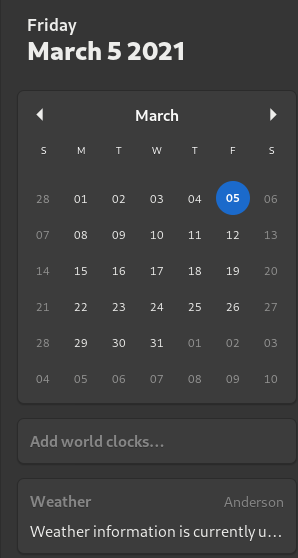

# gnome-minCal3-extension

## Description

This extension will remove event list and clock/calendar app buttons from the calendar window for Gnome 3. This is just an updated version of v2 by breiq.

