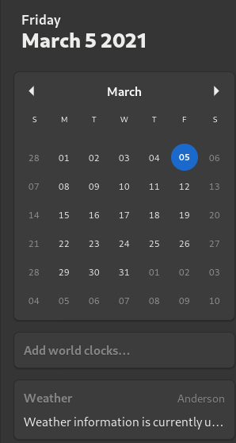

# gnome-minCal3-extension

## Description

This extension will remove event list and clock/calendar app buttons from the calendar window for Gnome 3. This is just an updated version of v2 by breiq. This is committed and available via the Gnome 3 Extensions page.

